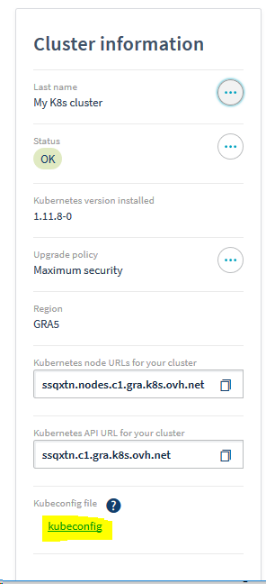
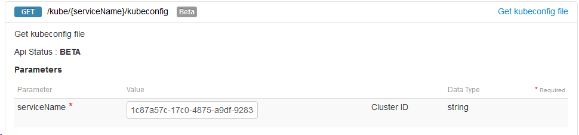
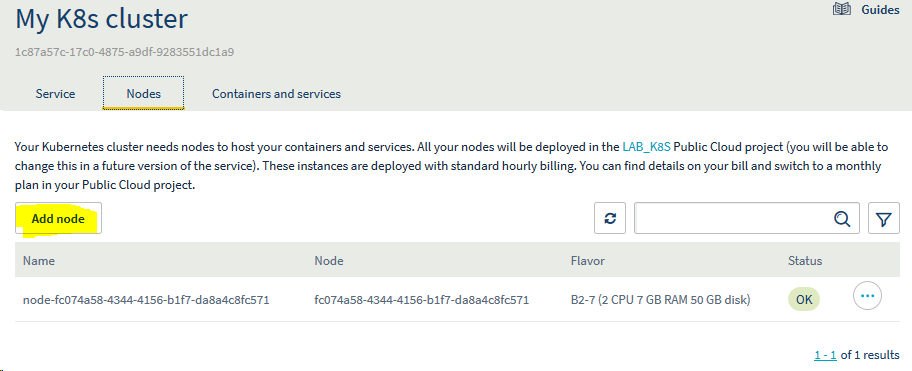
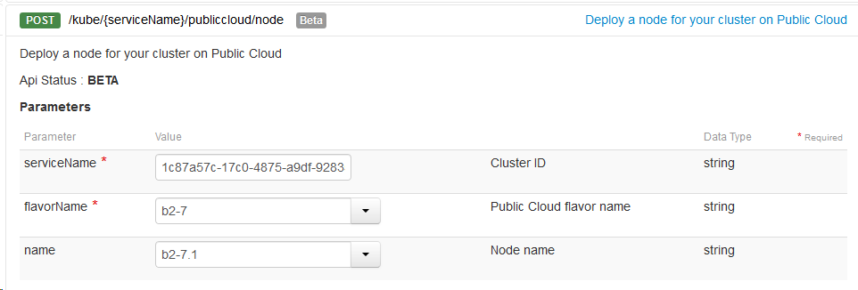

# Kubernetes setup

## Get your cluster config

Fetch your kube config file from the OVH Manager and save it in your local folder.



or via the OVH API https://api.ovh.com/console/#/kube/%7BserviceName%7D/kubeconfig#GET



**Note**: If you are using the API UI, you need to copy/paste the response in `kubeconfig.yaml` and run `sed -i 's/\\n/\n/g' kubeconfig.yaml`

Next, set the `KUBECONFIG` environment variable.


```bash
export KUBECONFIG=`pwd`/kubeconfig.yaml
```

and check that you can access your cluster. Be sure to install [kubectl](bootstrap.html#Install-kubctl) first.


```bash
export PATH=`pwd`:$PATH
kubectl cluster-info
```

## Add nodes

Check that you can connect and start adding your node, either via the OVH manager



or the OVH API https://api.ovh.com/console/#/kube/%7BserviceName%7D/publiccloud/node#GET




```bash
kubectl get nodes
```

## Helm/Tiller

Next, to simplify our deployement, we'll use helm.

[Helm](https://github.com/helm/helm) is a tool for managing packages of pre-configured Kubernetes resources known as _charts_.

It has two componenents:

- a local client `helm` to [install](https://helm.sh/docs/using_helm/#install-helm) in your local environment.
- a Kubernetes service `tiller`.

### Configure RBAC for Tiller

To allow tiller to manager the chars, we need first to create a `ServiceAccount` and give it `cluster-admin` rights.

The full doc is available [here](https://docs.gitlab.com/ee/install/kubernetes/preparation/tiller.html)


```bash
cat > config.yml <<EOF
apiVersion: v1
kind: ServiceAccount
metadata:
  name: tiller
  namespace: kube-system
---
apiVersion: rbac.authorization.k8s.io/v1
kind: ClusterRoleBinding
metadata:
  name: tiller
roleRef:
  apiGroup: rbac.authorization.k8s.io
  kind: ClusterRole
  name: cluster-admin
subjects:
  - kind: ServiceAccount
    name: tiller
    namespace: kube-system
EOF
```


```bash
kubectl apply -f config.yml # apply config
```

### Init helm

Use the `--upgrade` if `tiller`is already installed. Be sure to install [helm](bootstrap.html#Install-helm) first.


```bash
export PATH=`pwd`:$PATH
helm init --upgrade --service-account tiller # deploy the service in the remote cluster
```


```bash
kubectl get pods -n kube-system -l app=helm # check that the pod is up and running
```


```bash
helm version # check that both client and server version are the same
```


```bash
helm repo update # Update the helm package list
```
